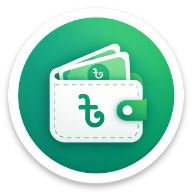
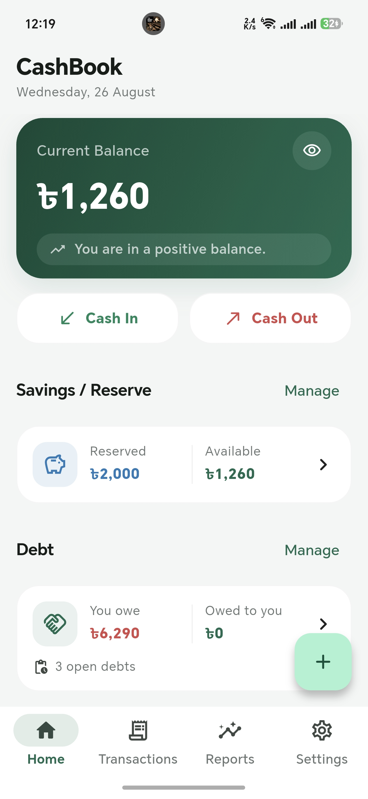
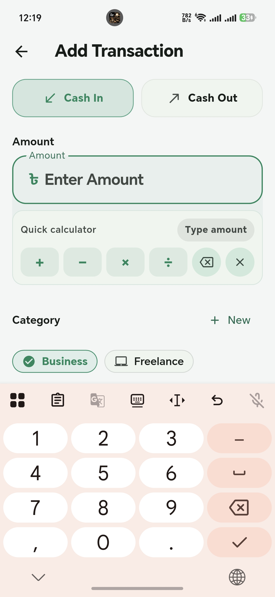
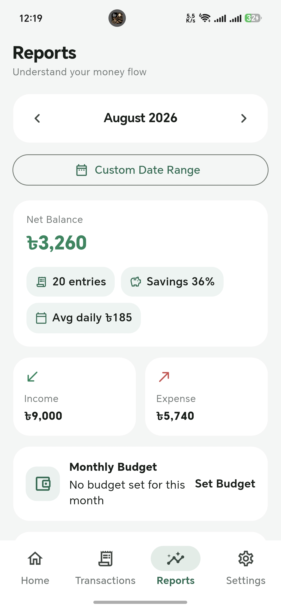

# 💰 CashBook

<p align="center">
  
</p>

<p align="center">
  A simple, fast and offline-first personal finance management app built with Flutter.
</p>

<p align="center">
  <a href="../../releases/latest">
    
  </a>
</p>

## 📱 About CashBook

CashBook helps you manage your daily income, expenses, savings and debt records in a simple way.

Designed for personal use with a focus on:

- ⚡ Fast performance
- 🔒 Offline-first data storage
- 🎯 Simple money tracking
- 📊 Clear financial overview

## ✨ Features

### 💵 Transactions

- Add Cash In / Cash Out
- Edit and delete transactions
- Category based tracking
- Search and filter history
- Date based records

### 💰 Balance Management

- Total balance overview
- Cash In / Cash Out summary
- Savings tracking
- Budget management

### 🤝 Debt Management

- Track money you owe
- Track money others owe you
- Record debt payments
- Payment history management

### 📊 Reports

- Monthly reports
- Category wise breakdown
- Income and expense analysis

### 🎨 Customization

- Light / Dark theme
- Dynamic color support
- Custom accent colors

## 📸 Screenshots

<p align="center">
  
  
  
</p>

## 🛠 Built With

- Flutter
- Dart
- SQLite
- Provider State Management

## 📦 Download

Get the latest APK from:

[Download Latest Release](../../releases/latest)

## 🚀 Development

Clone the repository:

```bash
git clone https://github.com/YOUR_USERNAME/cashbook.git
```
